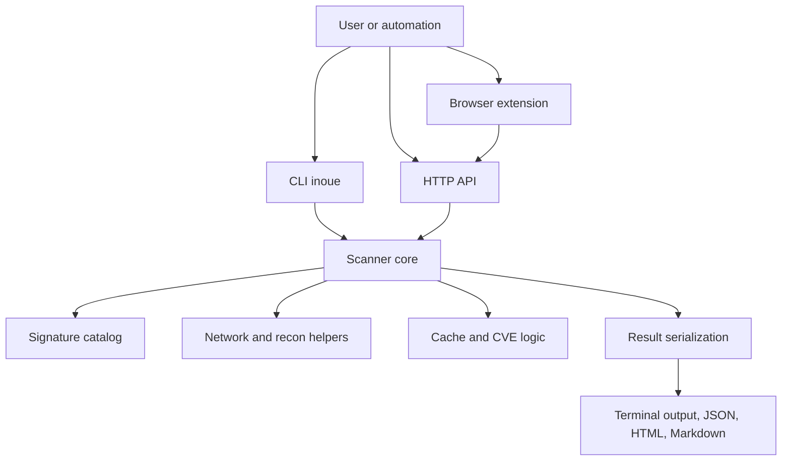
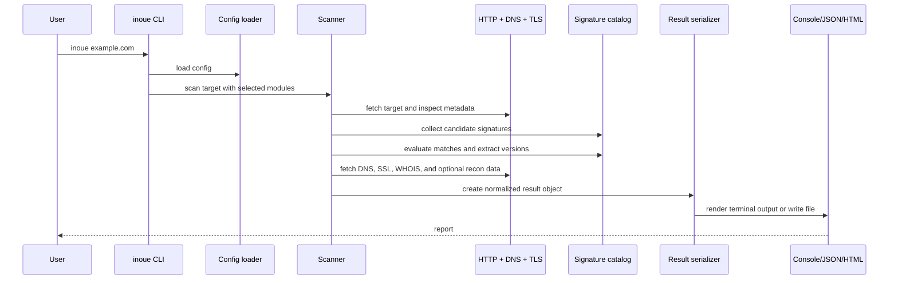
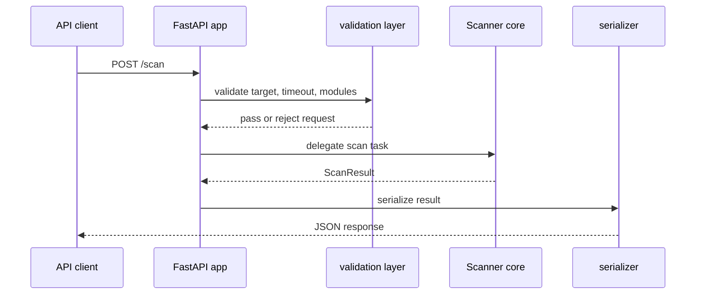

# Inoue architecture and design

This document explains the internal architecture of Inoue, the flow of a scan, and the separation of responsibilities across the CLI, API, scanner core, and browser extension.

## High level view

The architecture is intentionally compact. A small number of layers handle the entire workflow.

## Layer responsibilities

### CLI layer

The CLI layer is in `inoue.py`.

Responsibilities:

- parse user arguments
- load config from project and user settings
- print the banner and progress output
- call the scan engine with selected modules
- render terminal output
- write JSON, Markdown, and HTML reports
- handle update and CVE refresh commands
- expose global command behavior through the installed `inoue` executable

This is the main interface for interactive human use.

### API layer

The API layer is in `api/main.py`.

Responsibilities:

- validate request models
- enforce public target rules
- apply API key and rate limiting policies
- route requests to the scanner core
- serialize results in the same contract as CLI output
- expose `/health`, `/signatures`, `/scan`, and `/scan/batch`

The API does not duplicate scanning logic. It delegates scanning to the existing core functions so the behavior stays consistent across interfaces.

### Scanner core

The scanner core is in `core/scanner.py`.

Responsibilities:

- normalize targets and hostnames
- perform HTTP requests
- detect technologies from headers, HTML, scripts, cookies, meta tags, and path patterns
- evaluate confidence and evidence
- collect DNS, SSL, WHOIS, mail, subdomain, port, and directory data
- apply plugin enrichment and CVE matching
- produce a stable result object for CLI and API output

This is the most important layer in the project and is where most detection logic and platform behavior live.

### Signature catalog

The signature catalog is in `fingerprints/signatures.py` plus related catalog modules.

Responsibilities:

- define the known technology entries
- declare matching rules for headers, cookies, HTML, scripts, meta tags, and routes
- store version extraction patterns
- provide compatibility checks and duplicate detection support
- support import and review workflows for external catalog sources

The catalog is effectively the knowledge base that the scanner uses at runtime.

### Cache and CVE layer

The supporting layers are in `core/cache.py` and `core/cve.py`.

Responsibilities:

- store local scan outputs when caching is enabled
- enforce TTL-based expiration
- compare detected versions against local CVE entries
- preserve severity ordering and exact version matching behavior

### Browser extension layer

The browser extension is in `extension/`.

Responsibilities:

- read the active tab URL
- call the local Inoue API with a `fast` scan preset
- render the result in the popup UI
- store local API endpoint and key settings in extension storage

The extension is intentionally a thin adapter. It uses the same upstream scanner and result model instead of attempting to reimplement detection logic in JavaScript.

## Request flow for a single CLI scan

This shows the actual execution path. The scanner requests raw evidence, then matches and normalizes that evidence into a final report.

## Request flow for API usage

The API maintains the same output contract as the CLI. This is important because downstream users can rely on the same schema across tools.

## Why the architecture is this way

A few design principles are important:

### 1. One engine, multiple interfaces

The CLI, API, and extension all produce output by calling the same core logic. This keeps detection behavior aligned and prevents split-brain logic between tools.

### 2. Read only by default

The project is designed for reconnaissance and intelligence. It is not built to attack systems or to automate exploitation. This is reflected in the API security model and the scan design.

### 3. Evidence before guesswork

The scanner uses evidence from headers, HTML content, script URLs, cookies, and URL structure. It does not rely on a single signal when a more specific signal is available.

### 4. Stable contracts

The result object is serialized consistently so JSON output, HTML export, Markdown export, and API responses all preserve the same view of the target.

## Core data flow

The pipeline is roughly:

1. normalize input
2. fetch HTTP response
3. build candidate signatures
4. match traces to catalog entries
5. extract versions and confidence
6. gather recon modules and public intel
7. correlate CVEs and plugin enrichment
8. serialize and render output

This means the scanner acts as a structured evidence collector before any report is generated.

## Important files

- `inoue.py` for the CLI surface
- `api/main.py` for the FastAPI layer
- `core/scanner.py` for the detection engine
- `core/cache.py` for local caching
- `core/cve.py` for local CVE correlation
- `core/plugins.py` for plugin-based enrichment
- `extension/` for the browser extension
- `fingerprints/signatures.py` for technology definitions

## Operational considerations

The project aims for consistency across local CLI work, API usage, extension use, and future automation. A change to the scanner should be reflected across all consumers, not just one specific interface.

That is why the scanner core is treated as the source of truth while the CLI, API, and extension remain adapters.

## Summary

Inoue is best understood as a layered system:

- the catalog defines what can be detected
- the scanner decides how to detect it
- the API and extension expose the same results through different interfaces
- the CLI remains the primary human-facing entry point

This architecture keeps it simple, testable, and understandable while still supporting broader operational workflows.
